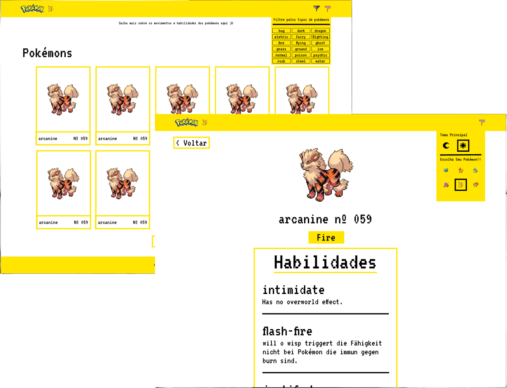

<h1>Introdução 🐲</h1>

Este aplicativo lista todos os pokémons existentes, ao clicar em um pokémon o usuário poderá visualizar informações importantes como: <em>movimentos; habilidades; tipo(s).</em>

<h1>Funcionalidades 💡</h1>
<ul>
    <li>Filtro pelos 18 tipos de pokémons;</li>
    <li>Botão que mostra mais 10 pokémos ao usuário;</li>
    <li>Botão que retorna para o topo da página;</li>
    <li>Sistema de carregamento para uma melhor usabilidade;</li>
    <li>Alteração de tema (escuro/claro);</li>
    <li>Tema secundário, referente ao pokémon escolhido.</li>
</ul>

<h1>Ferramentas ⚙</h1>

    
    
    
    
    
    

A decisão de usar <em>Styled-Components</em> é pelo fato de ser uma biblioteca — que junto do <em>React</em> — facilita a estilização dos componentes, evitando conflito entre as classes de mesmo nome. Sem contar a ajuda da biblioteca <em>React Router</em>, que facilitou a criação das rotas.

<h1>Tomada de Decições 🤔</h1>

Comecei pelo layout da página criando um esboço, para assim ter uma base de como seria o produto final.

<strong>Ideia Inicial</strong>

Logo depois montei uma lista <em>to-do</em>, com as ideias que tinha em mente, e ao decorrer do projeto eu finalizava pouco a pouco está lista.

Algumas das dificuldades que tive, foi com a criação do filtro, que inicialmente tinha em mente consumir a lista de pokémons de forma fracionada, ou seja, a cada clique no botão 'Carregar mais' o usuário requeria mais 10 pokémons. Porém, vi que isso não seria possível, então optei por consumir toda a lista de uma vez, e com o método <code>slice()</code> tive a ideia de limitar os pokémons que o usuário poderia visualizar.

<h1>Como Utiliza-lo 👨‍💻</h1>

<ol>
    <li>
        
No topo da raiz do repositório clique em 'code', e copie a url mostrada: <em>Code &gt HTTPS &gt Copy URL</em>

    </li>
    <li>
        
Com o auxílio do <em>GIT bash</em>, vá até o local que deseja inserir o clone do repositório;

    </li>
    <li>
        
Dentro do terminal execute o comando <code>git clone + URL</code>

    </li>
    <li>
        
Abra a pasta criada com o seu editor de texto de preferência. Ex: VScode, Sublime, Atom, etc.;

    </li>
    <li>
        
Na raiz da pasta, com <em>node.js</em> instalado, execute o comando: <code>npm install</code>

    </li>
    <li>
        
Ainda no terminal, execute o comando: <code>npm start</code>

    </li>
    <li>
        
Agora basta aproveitar a aplicação. 🤗

    </li>
</ol>

